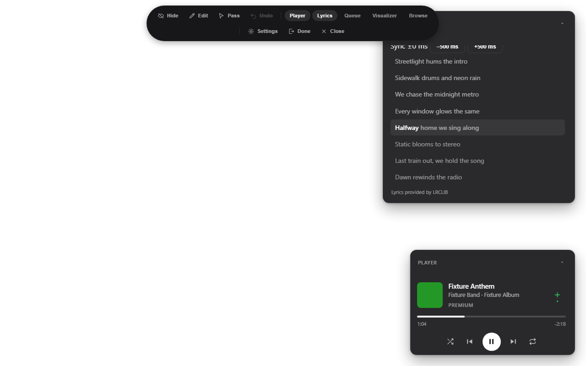
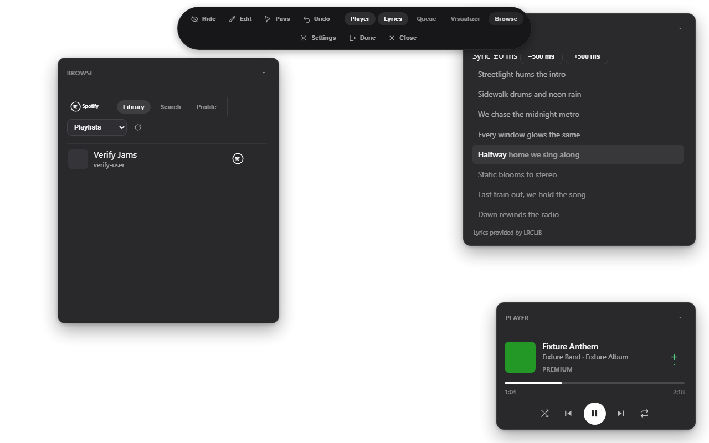
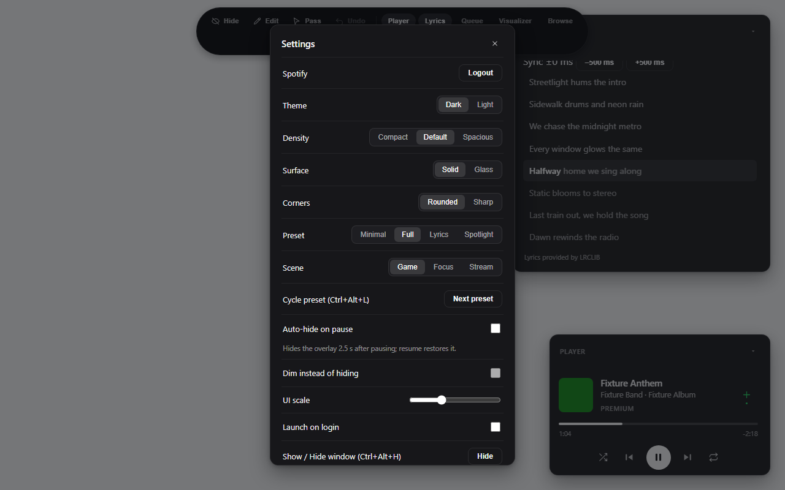
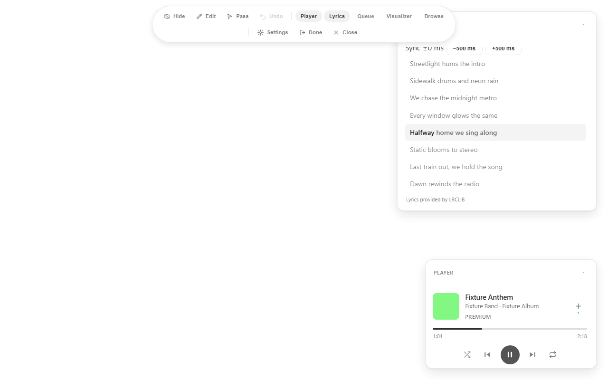

# Snapify Spotify Overlay


Snapify is an always-on-top Spotify overlay for Windows. It shows control and synced lyrics in panes you can drag, snap, and lock, without opening Spotify. It is built with Tauri v2, React 19, and Rust.



*The stage, dock, lyrics with karaoke highlight, and player. Shots on this page come from the mocked test harness, so names like Fixture Anthem are fixture data, not real listening.*

## Install and update

Download the latest `.msi` or `-setup.exe` from the releases page and run it.

The app checks for updates itself. To check by hand, open Settings and select Check for updates. When a newer signed release exists, the app downloads it and hands off to the installer. Login, layout, and shortcut data stay untouched.

## Connect Spotify

You need Spotify Premium for playback control. Free accounts see playback state but cannot control it.

1. Create an app in the Spotify developer dashboard.
2. Allowlist this redirect URI exactly:

   ```
   http://127.0.0.1:3000
   ```

3. Put your client ID in `CLIENT_ID` in `src-tauri/src/auth.rs`.
4. Start the overlay, select Login with Spotify, and approve in the browser.

If login reports that port 3000 is busy, close whatever holds the port and try again. Login listens on that port once per attempt.

## First run

1. Log in and pick a preset in Settings: minimal, full, lyrics, or spotlight. Any change you make becomes the custom layout.
2. Press **Ctrl+Alt+E**, drag panes by their headers, resize from edges and corners, then press **Esc**. Geometry, opacity, preset, theme, and density persist across restarts.
3. Pick a scene for the moment: **Game**, **Focus**, or **Stream**. Each scene keeps its own arrangement.
4. Press **Done** (or **Shift+Tab**) to drop into pass-through. The overlay stays visible while every mouse event goes to the game or window below.

## Daily use

- Glance, press, resume. Transport, like, and volume live in the player. Collapse any pane to its mini row with the chevron in its header.
- Sound output hides behind one line. The player shows `Sound plays on: name`. Expand **Devices** only to move sound with **Play here** or pin it with **Keep there**.
- Lyrics highlight line by line with word-by-word progress. Click a line to seek. Shift the sync with the offset chips when a track drifts.
- The queue shows what plays next. Select **Next from** to jump to the playing collection in Browse.
- Streaming: turn on **Auto-hide on pause** in Settings and the stage hides 2.5 seconds after pausing. Resume restores it at once. **Dim instead of hiding** ghosts it for window capture.

### Stream to Discord without sharing your desktop

Discord window share captures one window only, so the separate Snapify overlay window never appears in it. Screen share shows the overlay but exposes the whole desktop. Route the overlay through OBS instead:

1. Install OBS Studio.
2. Build one scene with Game Capture for the game plus a Window Capture of the Snapify window layered on top.
3. Stream from OBS directly, or start OBS Virtual Camera in OBS and select it as the camera in Discord.

Leave **Auto-hide on pause** OFF in Settings for this route, or the stage hides 2.5 seconds after pausing and viewers lose the overlay. Transparency rendering of click-through regions in OBS Window Capture is unverified — try before going live.

## Panes

- Player. Cover art, title, progress with click to seek, transport, volume, shuffle, repeat, a collapsible device picker, and a heart button that saves to Liked Songs or New Episodes.
- Lyrics. Line-synced lyrics with karaoke highlight on the active line, word-by-word progress, click a line to seek, and auto-scroll. Optional per-line translation (Spanish, French, German, Portuguese, Japanese). Lyrics come from LRCLIB and cache locally for offline replay, up to 500 tracks.
- Queue. The current track and what plays next, with refresh. The playing collection opens in the browse pane.
- Visualizer. Ambient motion driven by playback state. The Spotify API exposes no audio stream, so this is a motion signature, not spectrum analysis. It freezes on pause and stays off under reduced-motion.
- Browse. Library shelves behind one section select, search, artist and album detail, and your profile with top artists, top songs, and recently played.



## Settings



Settings holds theme (dark or light), density, surface (solid or glass), corners, UI scale, launch on login, lyrics options, translation language, scene, preset preview with Apply and Revert, streaming-safe toggles, layout and shortcut resets, the full shortcut list with remapping, and updates.



## Shortcuts

Global shortcuts work over games and fullscreen apps. You can remap them in Settings. The coach pill under the dock always shows your current interact key.

| Keys | Action |
| ---- | ------ |
| Ctrl+Alt+P | Play or pause |
| Ctrl+Alt+N | Next track |
| Ctrl+Alt+M | Mute or unmute |
| Ctrl+Alt+K | Like or unlike track |
| Ctrl+Alt+B | Seek back 10 seconds |
| Ctrl+Alt+F | Seek forward 10 seconds |
| Shift+Tab | Interact or pass through |
| Ctrl+Alt+E | Edit lock |
| Ctrl+Alt+H | Show or hide window |

Focused shortcuts work only when the overlay window has focus.

| Keys | Action |
| ---- | ------ |
| Ctrl+Alt+L | Cycle preset |
| Ctrl+Alt+C | Interact toggle, legacy |
| Alt+Arrow keys | Move the focused pane |
| Alt+Shift+Arrow keys | Resize the focused pane |
| Ctrl+Z in edit mode | Undo layout change |

## Troubleshooting

- **No devices.** Open Spotify on a phone, desktop, or the web player first then refresh the device list in the player. Or select **Play here** to play through the overlay itself.
- **Stuck in pass-through.** Press your interact key (shown in the coach pill and in Settings) or use the tray icon. The mouse alone cannot bring the overlay back by design.
- **Stale content with a notice.** Spotify throttled the app. The overlay pins the last good content and retries on its own. Queues pin to the first 10 until recovery.
- **Free account.** Transport stays disabled with one upgrade line. Everything else reads normally.
- **Lyrics missing or late.** The track may have no synced lyrics in LRCLIB, or the sync needs an offset nudge from the chips above the lines.
- **Lost arrangement.** Settings holds a layout reset. Ctrl+Z restores geometry while editing.

## Icons

The mark is a galaxy disc with a snap ring, orbital sound arcs, and one signal-green star. The tray icon is a one-color cut of the same mark that recolors to any theme. Sources live in `icon pack/` with usage notes in `icon pack/README.md`. The 17 in-app glyphs ship in `src/components/icons.tsx` and stay in sync with `icon pack/svg/ui/`.

## Spotify API limits worth knowing

Spotify restricted several endpoints for development-mode apps in February 2026, and the overlay follows the migration guide.

- Playlist track lists load only for playlists you own or collaborate on. Other playlists show metadata with a working Play button.
- Artist top tracks, browse categories, new releases, and batch `?ids=` fetches are gone. The app fetches items one by one and caps search pages at 10.
- Saving, removing, following, and containment checks use the generic `PUT`, `DELETE /me/library` and `GET /me/library/contains` endpoints with Spotify URIs.
- Related artists need extended quota mode. Without it the section stays empty instead of failing loudly.
- Removed response fields (popularity, followers, markets, publisher, and similar) are never read, so their absence changes nothing on screen.

## Develop

Prerequisites: Node 20 or later and stable Rust.

```powershell
npm install
npm run tauri dev
```

Useful commands:

| Command | What it does |
| ------- | ------------ |
| `npm run build` | Typecheck and production frontend build |
| `npm run test` | Vitest unit suite |
| `npm run test:web` | Playwright suite against mocked Tauri |
| `npm run test:web-real` | Playwright suite against the live Spotify API (needs a token) |
| `npm run verify` | Unit suite plus mocked web suite |
| `npm run tauri build` | Release binary plus MSI and NSIS installers |

The MSI target needs the WiX toolset on the build machine. The NSIS target needs NSIS. CI on `windows-latest` has both.

## Ship an update

1. Set the same version in `package.json`, `src-tauri/tauri.conf.json`, `src-tauri/Cargo.toml`, and the `snapify-overlay` entry in `src-tauri/Cargo.lock`. CI refuses a tag that disagrees with any of them.
2. Commit, then tag and push: `git tag vX.Y.Z; git push origin vX.Y.Z`.
3. The Publish workflow builds, signs, and opens a draft release. Review the assets, press Publish, and installed apps will offer the update through `latest.json`.

Signing setup, done once: generate a key with `npx tauri signer generate`, put the public key in `tauri.conf.json` under `plugins.updater.pubkey`, and store the private key and password as the `TAURI_SIGNING_PRIVATE_KEY` and `TAURI_SIGNING_PRIVATE_KEY_PASSWORD` repo secrets. Never commit the private key.

## Project layout

```
src-tauri/src/
  lib.rs      # window, tray, global shortcuts, command registry
  main.rs     # release entry point, calls into the library
  auth.rs     # PKCE login, 127.0.0.1:3000 callback, refresh, OS keychain
  spotify.rs  # Web API proxy with rate-limit and quota backoff
  lyrics.rs   # LRCLIB lookup, LRC parser, 500-track file cache
  overlay.rs  # click-through window-region clipping
  keybinds.rs # remappable shortcuts persisted beside app data
  system.rs   # launch-on-login
src/
  App.tsx            # shell, polling, drag, resize, snap, dock, toasts
  lib/spotify.ts     # response parsers and command wrappers
  lib/browse.ts      # library, search, and detail parsers
  lib/layout.ts      # presets, snap engine, persisted geometry
  lib/lrc.ts         # active-line lookup and time format
  lib/translate.ts   # per-line translations, localStorage cache capped at 200
  lib/player-sdk.ts  # headless Web Playback SDK device
  lib/keybinds.ts    # accelerator parsing and matching
  lib/overlay.ts     # hit-region reporting to the Rust side
  lib/updater.ts     # in-app update state
  lib/usePagedList.ts # paged list hook with throttle handling
  lib/types.ts       # shared shapes
  components/        # PlayerPane, LyricsPane, QueuePane, VisualizerPane,
                     # BrowsePane, SettingsModal, icons, SpotifyMark
assets/readme/       # screenshots on this page, captured from the mocked harness
verify/web/          # Playwright specs, Tauri mocks, and fixtures
```

Runtime state lives in the app local data dir (`keybinds.json`, `lyrics-cache.json`) and in `localStorage` (layout `snapify-layout-v3`, interact and edit prefs, theme, karaoke, translation language, density). Refresh tokens live only in the OS credential store.

## Security notes

- Never commit a Spotify client secret. The app uses PKCE and needs none.
- If a secret or token reaches chat or a commit, rotate it in the Spotify dashboard at once.

## Contributing

Issues and PRs are welcome. Keep panes glanceable and the bundle light. Prove behavior changes with the commands you ran plus before and after observations.
